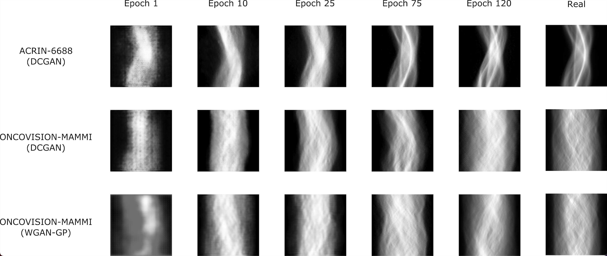

# A GAN approach to synthetic PET imaging generation for breast cancer diagnosis

Master's thesis; Universitat Oberta de Catalunya

**Author:** Javier Cantero Lorenzo

**Supervisor 1:** Héctor Espinós Morató

**Supervisor 2:** David Cascales Picó

# Experiments

DCGAN and WGAN with gradient penalty networks were tested for the synthesis of sinogram images with the aim of increasing the volume of training data for AI-based PET reconstructors in the context of breast cancer diagnosis.

ACRIN-6688 and ONCOVISION-MAMMI databases were the main case studies of this work.

The main evaluation metrics were manual inspection (Visual Turing Test) and the Fréchet Inception Distance score.

# Results

## Visual Turing Test

All evaluators confused a high percentage of generated images with real images.

## Quality vs Training

The quality of the generated images improved as the training progressed.

## Fréchet Inception Score

In all database-network pairs the FID score value decreased with training, which quantitatively supports that the models generate image sets with higher fidelity and greater diversity.

## Synthetic sinograms reconstructions

For each experiment, one of the generated sinograms was reconstructed by analytical methods (FBP), recovering the PET image with correct semantic representation of the anatomical region studied.

**DCGAN on ACRIN-6688**

**DCGAN on ONCOVISION-MAMMI**

**WGAN-GP on ONCOVISION-MAMMI**

## Conclusions

The studied networks are useful within the clinical context of PET medical imaging. The difference in the quality of the results between the two networks is not significantly different, which makes DCGAN preferable to WGAN-GP as it requires much less training time.
